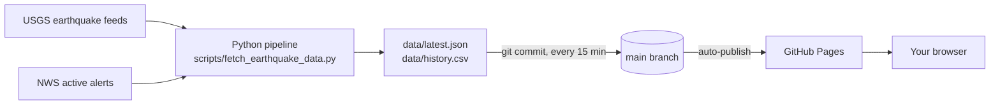

# 🌍 EarthPulse

**A free, open-source, ad-free dashboard tracking global earthquakes and active US severe weather alerts in real time — built entirely on GitHub Actions and GitHub Pages, with zero servers and zero cost to run.**

[](LICENSE)
[](https://github.com/RuHRabin/earthpulse/actions/workflows/update-data.yml)
[](https://ruhrabin.github.io/earthpulse/)

**[Live demo →](https://ruhrabin.github.io/earthpulse/)** _(after you deploy your own copy — see below)_

---

## The problem

Earthquakes are among the most dangerous, least predictable natural hazards on the planet, and hundreds of millions of people live along active fault lines — the west coast of the Americas, Japan, Indonesia, Turkey, the Himalayan belt, New Zealand. The USGS's National Earthquake Information Center locates roughly 20,000 earthquakes worldwide every year — about 50 a day — and its own long-run averages put major (magnitude 7.0–7.9) earthquakes at about 17 a year, plus roughly one "great" quake of magnitude 8.0 or higher. That data is public and free. But most of the polished tools built on top of it are commercial apps, wrapped in ads and tracking, or limited to a single country or region.

EarthPulse is a small attempt to fix that: a genuinely free, open, self-hostable dashboard that anyone can run, inspect, fork, and improve — with the entire "backend" being a 300-line Python script and a GitHub Actions cron schedule.

## What it does

- **Live world map** of every earthquake in the past 24 hours, sized and colored by magnitude
- **Key stats** — quakes today, quakes this week, strongest quake, average magnitude, active US weather alerts
- **Magnitude distribution and 7-day trend charts**
- **A searchable, filterable table** of significant earthquakes (M4.5+, past 30 days)
- **Active US severe weather alerts** from the National Weather Service, grouped by severity
- **A growing historical record** (`data/history.csv`) that accumulates one row per day for as long as your copy keeps running
- **Earthquake safety and preparedness guidance**
- Refreshes automatically every 15 minutes, forever, for free

## Why this architecture

| Piece | What it does | Why |
|---|---|---|
| **Python** (`scripts/fetch_earthquake_data.py`) | Fetches live data, aggregates it, writes JSON | Standard library only — no `pip install` step, nothing to break in CI |
| **GitHub Actions** (`.github/workflows/update-data.yml`) | Runs the script every 15 minutes, commits the result | Free compute, no server to maintain or pay for |
| **GitHub Pages** | Serves `index.html` straight from the `main` branch | Publishes automatically on every data commit — no separate deploy workflow |
| **Vanilla HTML/CSS/JS** (ES modules) | Renders the dashboard | See below |



### Why not React or Next.js here?

Good question if you came from a fork expecting one — the honest answer is that this dashboard has no client state worth managing, no routing, and no forms, so a framework buys little at real cost: a build step is one more thing that can break in CI, and it means GitHub Pages needs an Actions-based deploy workflow instead of just republishing the branch automatically. Plain ES modules keep the whole pipeline to "commit data → Pages republishes," with nothing to compile.

That said, this is a genuinely reasonable thing to want, and the JS is already organized as one small, focused module per panel (`js/map.js`, `js/charts.js`, `js/table.js`, `js/alerts.js`, `js/stats.js`) specifically so it's easy to port. A React/Next.js rewrite is on the roadmap below — contributions welcome.

## Deploy your own copy

1. **Fork this repository.**
2. In your fork, go to **Settings → Actions → General → Workflow permissions** and select **"Read and write permissions"** (the data-update workflow needs this to commit).
3. Go to **Settings → Pages**, and under **Build and deployment**, set **Source** to **"Deploy from a branch"**, branch **`main`**, folder **`/ (root)`**. Save.
4. Go to the **Actions** tab, open **"Update hazard data,"** and click **"Run workflow"** to trigger the first sync manually (otherwise it runs automatically within 15 minutes).
5. Your dashboard will be live at `https://<your-username>.github.io/<repo-name>/`.

That's the whole setup. No API keys, no secrets, no third-party accounts.

### Local development

The site is static, so any local file server works:

```bash
git clone https://github.com/RuHRabin/earthpulse.git
cd earthpulse
python3 -m http.server 8000
# open http://localhost:8000
```

To test the data pipeline locally:

```bash
python3 scripts/fetch_earthquake_data.py
# writes/updates data/latest.json and data/history.csv
```

## Project structure

```
earthpulse/
├── .github/workflows/
│   ├── update-data.yml     # runs the pipeline every 15 min, commits data/
│   └── ci.yml               # validates PRs (syntax + JSON checks)
├── data/
│   ├── latest.json          # current snapshot -- regenerated every run
│   └── history.csv          # one row per UTC day, accumulates over time
├── scripts/
│   └── fetch_earthquake_data.py
├── css/style.css
├── js/
│   ├── app.js                # entry point, orchestrates the panels
│   ├── utils.js               # shared helpers (color scale, time formatting)
│   ├── map.js  charts.js  table.js  alerts.js  stats.js
├── index.html
├── LICENSE
└── CONTRIBUTING.md
```

## Data sources

- [USGS Earthquake Hazards Program](https://earthquake.usgs.gov/earthquakes/feed/v1.0/geojson.php) — real-time GeoJSON feeds, public domain, no key required
- [National Weather Service API](https://www.weather.gov/documentation/services-web-api) — active alerts, US only, no key required (a descriptive `User-Agent` is requested by NWS policy; see the script)
- [OpenFreeMap](https://openfreemap.org) — the map's basemap style, free and keyless with no published request limit. (The original build used CARTO's free raster tiles; CARTO began requiring an API key in August 2026, so the map now renders as vector tiles via MapLibre GL instead. If OpenFreeMap ever changes terms too, only `js/map.js`'s `BASEMAP_STYLE_URL` needs to change — markers, popups, and everything else are independent of the basemap.)

EarthPulse is not affiliated with either agency. **This is an awareness and education tool, not an official early-warning or emergency-alert system** — it refreshes every 15 minutes, which is far too slow for life-safety alerting. In an emergency, follow your local emergency services and national agencies.

## Roadmap / good first issues

- [ ] Light/dark theme toggle
- [ ] React or Next.js rewrite (the JS is already modular — see "Why not React" above)
- [ ] More hazard types: wildfires (NASA FIRMS), volcanic activity, tsunami warnings
- [ ] i18n — many high-risk seismic regions aren't English-first
- [ ] Per-country / per-region breakdown view
- [ ] A longer-range historical chart once `data/history.csv` has enough rows
- [ ] Push notifications via a service worker for M6+ events
- [ ] SRI hashes on the CDN `<script>` tags for extra supply-chain hardening

See [CONTRIBUTING.md](CONTRIBUTING.md) to get started.

## License

[MIT](LICENSE) — do whatever you'd like with this, including running your own copy, forking it commercially, or ripping out the parts you don't want.
